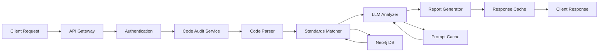
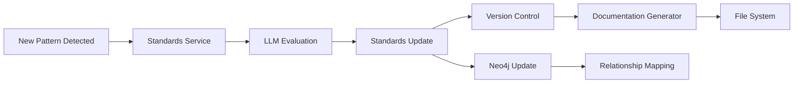

# Code Standards Auditor - System Architecture

## Version 1.0.0
**Date**: 2025-01-27
**Author**: AI Code Auditor Agent

## Table of Contents
1. [Executive Summary](#executive-summary)
2. [System Overview](#system-overview)
3. [Core Components](#core-components)
4. [Technology Stack](#technology-stack)
5. [Architecture Patterns](#architecture-patterns)
6. [Data Flow](#data-flow)
7. [API Design](#api-design)
8. [Security Considerations](#security-considerations)
9. [Deployment Architecture](#deployment-architecture)
10. [Performance Optimization](#performance-optimization)

## Executive Summary

The Code Standards Auditor is an AI-powered API service designed to integrate into development pipelines, providing automated code review and standards management. The system leverages Large Language Models (LLMs) to analyze code against established best practices and maintains living documentation of coding standards that evolve with emerging techniques.

### Key Capabilities
- **Automated Code Review**: Real-time analysis of code against project-specific and language-specific standards
- **Standards Documentation Management**: Dynamic creation and maintenance of coding standards documentation
- **Pipeline Integration**: Seamless integration with CI/CD pipelines through RESTful API
- **Multi-Language Support**: Extensible framework supporting Python, Java, and other languages
- **Cost-Optimized LLM Usage**: Leverages prompt caching and batch processing for efficient API usage

## System Overview

### Mission Statement
To provide intelligent, automated code quality assurance that adapts to evolving best practices while maintaining comprehensive, accessible documentation of coding standards.

### Primary Functions
1. **Code Audit Service**: Analyze submitted code for compliance with standards
2. **Standards Management Service**: Create, update, and version control coding standards documentation

### System Boundaries
- **Input**: Source code files, project context, language specifications
- **Output**: Audit reports, recommendations, updated standards documentation
- **External Dependencies**: Google Gemini API, Anthropic API, Neo4j database

## Core Components

### 1. API Gateway Layer
```
├── FastAPI Application
│   ├── Authentication Middleware
│   ├── Rate Limiting
│   ├── Request Validation
│   └── Response Caching
```

### 2. Core Services

#### 2.1 Code Audit Service
- **Purpose**: Analyze code against standards
- **Components**:
  - Code Parser (AST-based analysis)
  - Standards Matcher
  - LLM Analyzer (Gemini integration)
  - Report Generator

#### 2.2 Standards Management Service
- **Purpose**: Maintain coding standards documentation
- **Components**:
  - Standards Repository Manager
  - Version Controller
  - Documentation Generator
  - Standards Evolution Tracker

#### 2.3 LLM Integration Service
- **Purpose**: Manage LLM interactions efficiently
- **Components**:
  - Prompt Template Manager
  - Context Window Optimizer
  - Batch Request Handler
  - Cache Manager

### 3. Data Layer

#### 3.1 Neo4j Graph Database
- **Purpose**: Store relationships between code patterns, standards, and violations
- **Schema**:
  - Nodes: Standards, Rules, Projects, CodePatterns, Violations
  - Relationships: VIOLATES, FOLLOWS, UPDATED_FROM, RELATES_TO

#### 3.2 File System Storage
- **Standards Documentation**: Versioned markdown files
- **Audit Reports**: JSON/HTML reports
- **Configuration**: YAML/JSON config files

### 4. Integration Layer
- **CI/CD Webhooks**: GitHub Actions, Jenkins, GitLab CI
- **IDE Plugins**: VSCode, IntelliJ extensions
- **Monitoring**: Prometheus metrics, custom dashboards

## Technology Stack

### Core Technologies
- **Language**: Python 3.11+
- **Framework**: FastAPI 0.109+
- **Database**: Neo4j 5.x
- **LLM APIs**: 
  - Google Gemini Pro/Ultra
  - Anthropic Claude (fallback)
- **Caching**: Redis
- **Queue**: Celery with Redis backend

### Development Tools
- **Testing**: pytest, pytest-asyncio
- **Documentation**: Sphinx, MkDocs
- **Code Quality**: black, flake8, mypy
- **Version Control**: Git with feature branch strategy

### Infrastructure
- **Containerization**: Docker
- **Orchestration**: Docker Compose (dev), Kubernetes (prod)
- **Monitoring**: Prometheus + Grafana
- **Logging**: Structured logging with JSON

## Architecture Patterns

### 1. Hexagonal Architecture
- **Core Domain**: Business logic independent of infrastructure
- **Ports**: Interfaces for external communication
- **Adapters**: Implementation of external integrations

### 2. Event-Driven Architecture
- **Events**: CodeSubmitted, StandardsUpdated, AuditCompleted
- **Event Bus**: For decoupled component communication
- **Event Sourcing**: Audit trail of all changes

### 3. Microservices Pattern
- **Service Boundaries**: Clear separation of concerns
- **API Gateway**: Single entry point
- **Service Discovery**: Dynamic service registration

## Data Flow

### Code Audit Flow


### Standards Update Flow


## API Design

### RESTful Endpoints

#### Code Audit Endpoints
```
POST   /api/v1/audit
GET    /api/v1/audit/{audit_id}
GET    /api/v1/audit/report/{audit_id}
POST   /api/v1/audit/batch
```

#### Standards Management Endpoints
```
GET    /api/v1/standards
GET    /api/v1/standards/{language}
POST   /api/v1/standards/update
GET    /api/v1/standards/history
GET    /api/v1/standards/version/{version_id}
```

#### Administration Endpoints
```
GET    /api/v1/health
GET    /api/v1/metrics
POST   /api/v1/config/update
GET    /api/v1/cache/stats
```

### Request/Response Schema

#### Audit Request
```json
{
  "code": "string",
  "language": "python|java|javascript",
  "project_context": {
    "project_id": "string",
    "custom_rules": ["array"],
    "severity_threshold": "info|warning|error|critical"
  },
  "options": {
    "use_cache": true,
    "batch_mode": false,
    "detailed_report": true
  }
}
```

#### Audit Response
```json
{
  "audit_id": "uuid",
  "timestamp": "iso8601",
  "summary": {
    "score": 85,
    "violations": 5,
    "suggestions": 12
  },
  "details": [
    {
      "line": 42,
      "column": 15,
      "severity": "warning",
      "rule": "naming-convention",
      "message": "string",
      "suggestion": "string"
    }
  ],
  "metadata": {
    "processing_time": 1.23,
    "llm_tokens_used": 1500,
    "cache_hit": true
  }
}
```

## Security Considerations

### Authentication & Authorization
- **API Keys**: Environment variable storage
- **JWT Tokens**: For session management
- **Rate Limiting**: Per-client throttling
- **RBAC**: Role-based access control

### Data Security
- **Encryption at Rest**: For sensitive configuration
- **Encryption in Transit**: TLS 1.3
- **Input Validation**: Strict schema validation
- **Sanitization**: Code injection prevention

### Compliance
- **Audit Logging**: Complete request/response logging
- **Data Retention**: Configurable retention policies
- **GDPR Compliance**: Data anonymization options

## Deployment Architecture

### Development Environment
```yaml
services:
  api:
    build: .
    ports: ["8000:8000"]
    environment:
      - GEMINI_API_KEY=${GEMINI_API_KEY}
      - NEO4J_PASSWORD=${NEO4J_PASSWORD}
  
  neo4j:
    image: neo4j:5-community
    ports: ["7474:7474", "7687:7687"]
  
  redis:
    image: redis:7-alpine
    ports: ["6379:6379"]
```

### Production Environment
- **Load Balancer**: NGINX/HAProxy
- **Application Servers**: Multiple FastAPI instances
- **Database Cluster**: Neo4j cluster with read replicas
- **Cache Layer**: Redis cluster
- **CDN**: For static assets and documentation

## Performance Optimization

### LLM Cost Optimization
1. **Prompt Caching**
   - Cache frequently used prompts
   - Implement semantic similarity matching
   - TTL-based cache invalidation

2. **Batch Processing**
   - Aggregate similar requests
   - Scheduled batch processing for non-urgent audits
   - Parallel processing with rate limiting

3. **Context Window Management**
   - Dynamic context sizing
   - Relevance-based context selection
   - Chunking strategies for large files

### System Performance
1. **Async Processing**
   - Non-blocking I/O operations
   - Background task processing
   - WebSocket for real-time updates

2. **Database Optimization**
   - Query optimization
   - Index management
   - Connection pooling

3. **Caching Strategy**
   - Multi-level caching (Memory, Redis, CDN)
   - Smart cache invalidation
   - Preemptive cache warming

## Project Structure

```
/code-standards-auditor/
├── api/
│   ├── __init__.py
│   ├── main.py              # FastAPI application
│   ├── routers/             # API endpoints
│   ├── middleware/          # Authentication, logging
│   └── schemas/             # Pydantic models
├── core/
│   ├── __init__.py
│   ├── audit/               # Code audit logic
│   ├── standards/           # Standards management
│   └── llm/                 # LLM integration
├── services/
│   ├── __init__.py
│   ├── gemini_service.py    # Gemini API integration
│   ├── neo4j_service.py     # Graph database operations
│   └── cache_service.py     # Caching logic
├── utils/
│   ├── __init__.py
│   ├── parsers/             # Code parsers
│   ├── validators/          # Input validation
│   └── formatters/          # Output formatting
├── config/
│   ├── __init__.py
│   ├── settings.py          # Configuration management
│   └── prompts/             # Prompt templates
├── tests/
│   ├── unit/
│   ├── integration/
│   └── fixtures/
├── docs/
│   ├── ARCHITECTURE.md      # This document
│   ├── API.md               # API documentation
│   └── DEPLOYMENT.md        # Deployment guide
├── scripts/
│   ├── setup.sh             # Environment setup
│   ├── migrate.py           # Database migrations
│   └── seed_standards.py    # Initial standards
├── docker/
│   ├── Dockerfile
│   └── docker-compose.yml
├── .env.example
├── .gitignore
├── requirements.txt
├── pyproject.toml
└── README.md
```

## Evolution Strategy

### Continuous Improvement
1. **Pattern Recognition**: Identify emerging best practices
2. **Standards Evolution**: Automated standards updates based on new patterns
3. **Feedback Loop**: Learn from audit results and developer feedback
4. **Research Integration**: Incorporate latest research and techniques

### Versioning Strategy
- **Semantic Versioning**: MAJOR.MINOR.PATCH
- **Standards Versions**: Timestamped with changelog
- **API Versions**: Backward compatibility maintenance

## Next Steps

1. **Phase 1**: Core API and basic audit functionality
2. **Phase 2**: LLM integration and optimization
3. **Phase 3**: Standards management and versioning
4. **Phase 4**: Advanced features and integrations
5. **Phase 5**: Production deployment and scaling

---

*This architecture document is a living document and will be updated as the system evolves.*
